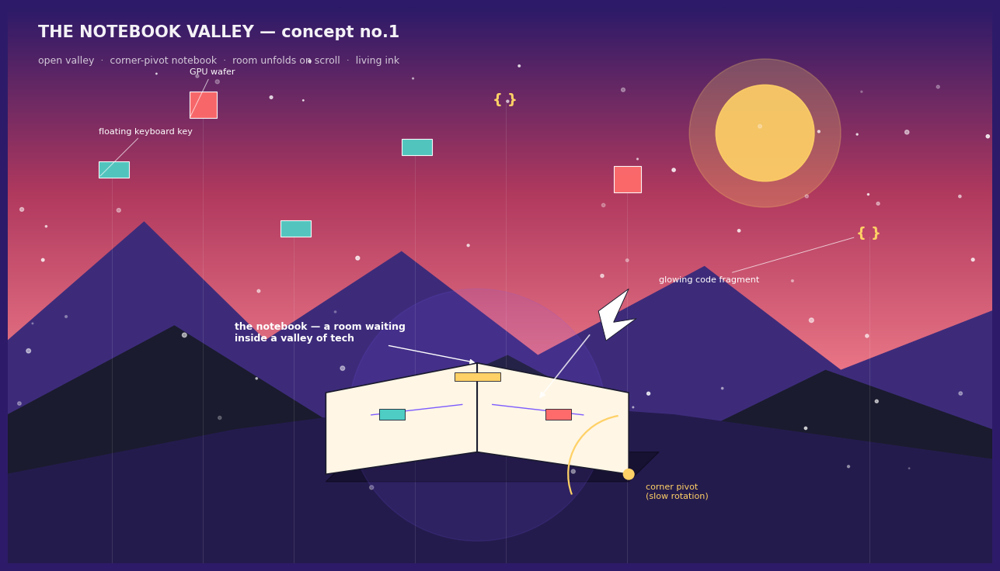
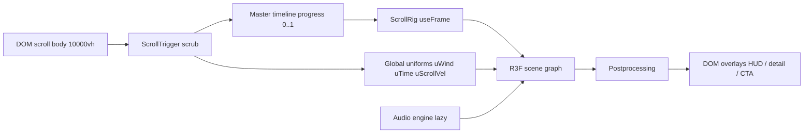
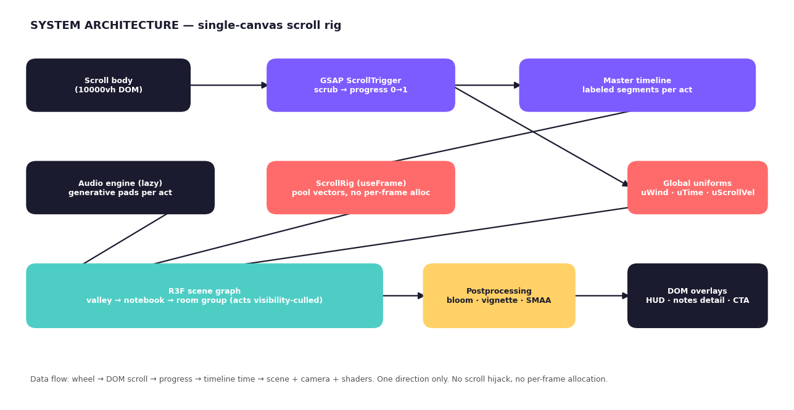
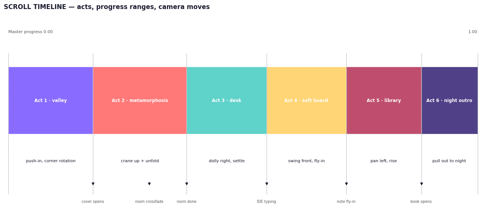
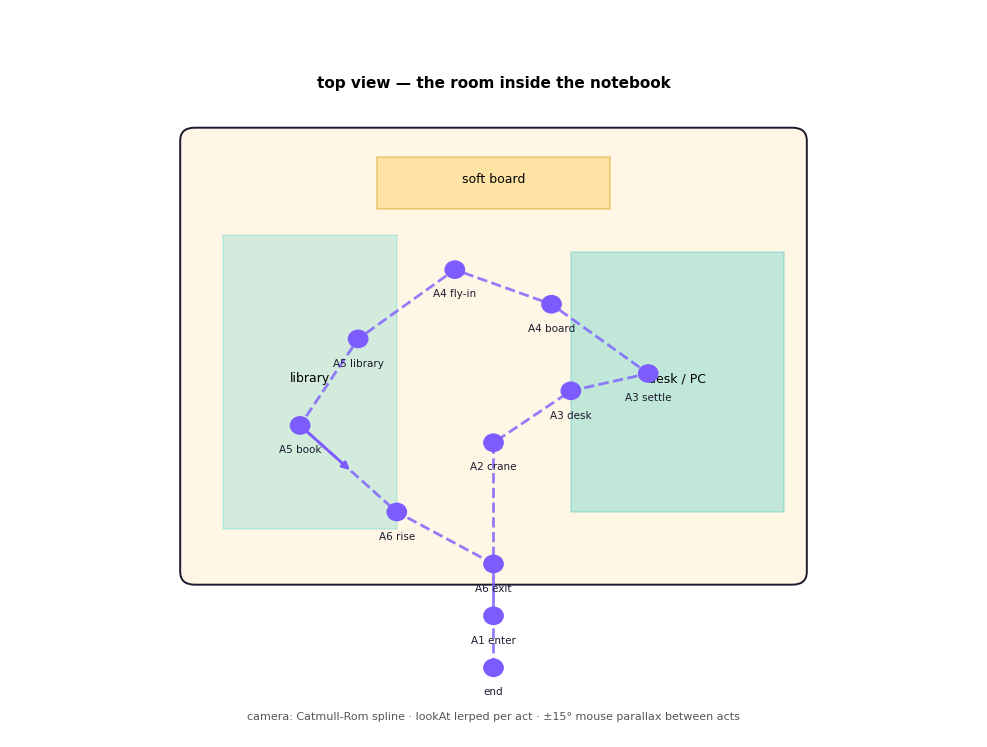

# THE NOTEBOOK VALLEY
## Master build documentation — v1.0
> A scroll-driven 3D portfolio. A notebook rotates in a valley of tech artifacts; scrolling opens it into a room; the camera tours the room: desk → soft board → library → night outro.
> This document is written to be executed by a developer or coding CLI with zero ambiguity.

---

## 0. Concept summary

| | |
|---|---|
| Working title | The Notebook Valley |
| Experience | One continuous scroll, one WebGL canvas, six acts |
| Core metaphor | The portfolio *is* a living notebook; the room *is* its open pages |
| Emotional arc | curiosity → wonder → intimacy → play → depth → warmth |
| North star | The metamorphosis (Act 2) and the snow-globe notes (Act 4) must give goosebumps |



---

## 1. Tech stack

| Layer | Choice | Version rule |
|---|---|---|
| Build | Vite + React 18+ | latest stable |
| 3D | three.js + @react-three/fiber + @react-three/drei | pinned, no nightly |
| Scroll | gsap + ScrollTrigger | pinned |
| State | zustand | single store: progress, act, quality, audio |
| Post | @react-three/postprocessing (bloom, vignette, SMAA) | — |
| Models | Blender → glTF (Draco or Meshopt compression) | ≤ 60 kB per hero asset |
| Textures | KTX2/Basis, atlas where possible | ≤ 1024² unless hero |
| Audio (opt-in) | howler for SFX + WebAudio generative pads | lazy-loaded |
| Deploy | Vercel / Netlify static | HTTP2, brotli |

**Forbidden:** scroll-jacking libraries, locomotive-scroll, per-frame `new` allocations, hand-rolled scroll physics.

---

## 2. Architecture — the single-canvas scroll rig



**Rules**
1. Canvas is `position: fixed; inset: 0; z-index: 0`. Scroll body is an empty tall div (10000vh) at z-index -1 driving length.
2. `useFrame` runs exactly one thing: `masterTimeline.time = progress * duration` then renderer render. No other per-frame logic except pooled vector math.
3. Scroll progress is also mirrored into a zustand store throttled to 10 Hz for DOM overlays (never in useFrame).
4. Reversible: scrubbing up must perfectly reverse every animation (GSAP default when scrubbed — do not use one-shot tweens).



---

## 3. Master scroll timeline

| Act | Progress | Duration | Segment label | Camera move |
|---|---|---|---|---|
| 1 Valley | 0.00–0.18 | 18% | `valley` | slow push-in |
| 2 Metamorphosis | 0.18–0.38 | 20% | `open` `unfold` | crane up + back |
| 3 Desk | 0.38–0.55 | 17% | `desk` | dolly right, settle |
| 4 Soft board | 0.55–0.72 | 17% | `board` `flyin` | swing to front wall, fly-in on click |
| 5 Library | 0.72–0.88 | 16% | `library` `book` | pan left, gentle rise |
| 6 Night outro | 0.88–1.00 | 12% | `outro` | vertical pull-out |



**Timeline construction (MasterTimeline.ts)**

```ts
const tl = gsap.timeline({ paused: true, defaults: { ease: 'none' } });
tl.addLabel('valley')                 // 0.00
  .to(camera.position, { /* spline point A1 */ }, 0)
  .addLabel('open', 0.18)             // hinge open
  .to(hinge.rotation, { x: -Math.PI, ease: 'back.out(1.2)', duration: 0.08 }, 0.18)
  .addLabel('unfold', 0.30)           // room crossfade illusion
  .addLabel('desk', 0.38)
  .addLabel('board', 0.55)
  .addLabel('flyin', 0.62)
  .addLabel('library', 0.72)
  .addLabel('book', 0.80)
  .addLabel('outro', 0.88)
  .to({}, { duration: 1 });           // master length normalised to 1
```

---

## 4. Camera choreography

- **Path**: THREE.CatmullRomCurve3 through 11 authored keyframe positions (see diagram), `centripetal`, tension default.
- **LookAt**: per-act target objects (notebook → room center → monitor → board → book → sky). GSAP tweens a `lookTarget` vector; camera.lookAt(lookTarget) each frame.
- **FOV**: 50 default; tightens to 42 during `flyin`; widens to 58 during `outro`.
- **Parallax**: between acts only, mouse adds ±15° yaw / ±8° pitch offset, lerped at 5%/frame, disabled during `flyin` and reduced-motion.
- **Handoff**: ScrollRig owns position; the spline provides *base* position and parallax adds *offset* — never write to camera.position from two systems.



**Camera keyframes (world units, room 8×8 m, y-up):**

| # | Act | Position (x,y,z) | LookAt |
|---|---|---|---|
| 0 | enter | (0, 1.2, -6.5) | notebook (0,0.8,0) |
| 1 | crane | (0, 3.5, -3.0) | room center (0,1.2,0) |
| 2 | desk approach | (2.2, 1.6, -1.2) | monitor (2.6,1.3,0.6) |
| 3 | desk settle | (2.6, 1.5, -0.6) | monitor |
| 4 | board | (0.4, 1.6, -1.6) | board (0,1.7,3.9) |
| 5 | fly-in | (note position + normal × 0.35) | note center |
| 6 | library | (-2.4, 1.7, -1.0) | shelf (-3.6,1.4,0.4) |
| 7 | book | (-1.4, 1.8, -1.8) | floating book center |
| 8 | rise | (0, 3.2, -2.2) | room center |
| 9 | exit | (0, 7.0, -6.0) | notebook |
| 10 | end | (0, 9.5, -9.0) | valley sky |

---

## 5. Act specifications

### Act 1 — Valley (0.00–0.18)
- **Environment**: gradient sky dome (violet → coral → cream, top-down), exponential fog `color #2D1B69 density 0.028`, valley floor disc r=30, two mountain ridge rings (low-poly, silhouette layered).
- **Floating props**: ~40 instanced meshes (keyboard key caps, GPU wafers, USB sticks, `{ }` text sprites) on individual sine loops `y = base + sin(t*speed + phase)*amp`, slow rotation.
- **Notebook**: hero glTF, ~3 k tris. Group origin relocated to corner vertex → `rotation.y = slow` reads as corner-pivot rotation. Add micro-float and paper-edge flutter (vertex shader, amplitude 0.004·uWind).
- **Particles**: 300 fireflies, additive, custom points shader, wrap in bounding box.
- **DOM**: title + subtitle, parallaxed opposite scroll, fade out by 0.12.

### Act 2 — Metamorphosis (0.18–0.38) — CRITICAL ACT
1. `0.18–0.26`: cover hinge rotates 180° around spine (`back.out(1.2)`), pages fan 3° each, camera push-in continues.
2. `0.26–0.30`: open notebook scales ×1.6 toward camera; glow bloom rises.
3. `0.30–0.31` THE ILLUSION: pre-built `RoomGroup` (scale-matched) fades/scales in exactly as notebook scales out. Overlap 0.01 progress. Never attempt a true geometric morph.
4. `0.31–0.38`: walls rise (y-scale 0→1, stagger 0.02), furniture drop-in with `back.out(2)` + dust puff particles (12 per item, 0.6 s life), neon floor strip draws on (shader reveal, 1 s).
5. Room hides notebook for the rest of the site; notebook returns only in Act 6 (night variant).

**Room layout** (8×8 m, wall height 3.2): desk right wall (with dual monitors), library shelves left wall (5 shelves), soft board front wall 2.4×1.2 m cork, door implied behind camera start, ceiling aperture for Act 6 exit.

### Act 3 — Desk (0.38–0.55)
- Monitor screen = `CanvasTexture` 1024×640, redrawn only while act ≥ 40% visible (dirty-flag). Two modes alternating every 9 s: (a) terminal typing skills (`skills.ts` lines typed at 40 chars/s, syntax highlight), (b) radial skill chart with pulse rings.
- Keyboard: instanced keycaps, glow wave travels across rows every 4 s (instanceColor lerp).
- Props: mug (steam = 20-particle ribbon shader), figurine, cable curves (TubeGeometry), LED strip under desk edge (emissive #4ECDC4, feeds bloom).
- **Terminal overlay**: pressing `T` (or tapping monitor) opens a real interactive CLI (DOM overlay, see §8). Easter egg surface.

### Act 4 — Soft board (0.55–0.72)
- Notes: InstancedMesh, one per project (4–6), 0.09×0.09 m paper quads with per-instance color (project type), slight random tilt baked into instance matrix.
- **Paper curl vertex shader**: `pos.z += curl * pow(uv.x, 2.0) * uWind * flutter(notePhase)` — alive but subtle.
- **Hover** (raycast): note lifts 0.04 m off board, shadow blob scales, spring via damped lerp in useFrame (pooled).
- **Click → snow-globe fly-in** (the signature feature):
  1. Timeline scrub pauses (store `flyinLock = true`), camera tweens to 0.35 m in front of the note (0.9 s, `power3.inOut`).
  2. Note unfolds: quad → open paper booklet → the project diorama scales out of it (each project has a miniature scene module, ≤ 5 k tris, lazy-loaded at Act 2 end).
  3. While inside: drag orbits the diorama (constrained ±30°), HUD shows project copy + links (DOM, crisp text — never render long text in 3D).
  4. Close (X / Esc / scroll down): reverse, scrub resumes.
- **Board details**: pins (emissive heads — the act's single bloom hero), red thread connecting related notes (catenary curves), washi-tape corner scraps.

### Act 5 — Library (0.72–0.88)
- Shelves: 5 boards × ~26 books = InstancedMesh with per-instance spine CanvasTexture atlas (title, hue, wear). Raycast hover: book slides 2 cm out, spine brightens.
- **Hero book** "The Story So Far" (unique geometry, cloth cover #B83B5E, gold foil title):
  1. `0.72–0.78`: eases off shelf (bezier to room center, 1.4 m height), camera rises to meet it.
  2. `0.78–0.83`: opens 110° — two-page spread; left page = experience timeline (DOM overlay aligned via CSS3DRenderer-free manual projection — simpler: draw to CanvasTexture at 2× for crispness), right page = portrait + bio.
  3. Cursor proximity bends page corners (vertex displacement toward cursor, radius 0.15 m, damped).
- Ambient: shelf-edge light strip, dust motes in a light shaft.

### Act 6 — Night outro (0.88–1.00)
- Camera pulls through ceiling aperture; room shrinks below, revealed to sit inside the open notebook, which sits in the valley — **now night**.
- Sky swaps to star dome; the room's warm light leaks through the notebook pages (page-edge emissive shader, pulse synced to uTime).
- **Signature ritual**: the visitor's saved signature (see §8) appears as a labeled star in a constellation of past visitors (localStorage array; first visit = they become the newest star, animated draw-in).
- Notebook closes gently (reverse hinge, `power2.inOut`); final CTA (contact/socials) fades in over the closed notebook; loop hint "scroll up to reopen".

---

## 6. Art direction

**Palette** (CSS custom props mirrored as three.js colors):

| Token | Hex | Use |
|---|---|---|
| `--violet` | #7C5CFF | primary magic, glow, accents |
| `--coral` | #FF6B6B | energy, alerts, type B notes |
| `--sun` | #FFD166 | warmth, pins, type A notes |
| `--mint` | #4ECDC4 | tech, LED strips, terminal |
| `--cream` | #FFF6E5 | paper, walls |
| `--ink` | #1A1B2E | text, outlines, night base |

**Lighting**: key = warm directional (sun, intensity 1.1, #FFE0B0), fill = violet hemisphere (#7C5CFF/#1A1B2E, 0.5), practicals: desk LED (mint), board pins (sun), shelf strip (violet) — these three are the only bloom sources per act.
**Tone mapping**: ACESFilmic, exposure 1.1, bloom threshold 0.85 strength 0.55 radius 0.6, vignette 0.3.
**Materials**: MeshStandardMaterial with flat saturated albedo; paper uses subtle fiber normal map; felt board = high-roughness + fuzz fresnel fake (rim emissive 0.03).
**Rule**: ONE emissive hero per act. The eye always has a destination.

---

## 7. Shaders inventory

| Shader | Uniforms | Effect |
|---|---|---|
| `paperFlutter` | uWind, uTime, phase | notebook page edges + note corners breathe |
| `scrollWind` | uWind | grass/steam/threads sway with scroll velocity |
| `curl` | uWind, notePhase | sticky-note paper curl |
| `neonDraw` | uProgress | floor strip reveal |
| `glowPages` | uTime | night leak through notebook pages |
| `inkTrail` | uMouse history | cursor ribbon, additive fade |
| `starfield` | uTime | twinkle + signature-star pulse |
| `particlePuff` | life | dust puffs, one-shot bursts |

`uWind = clamp(|scrollDelta| / 40, 0, 1)` smoothed over 300 ms; written once per frame from ScrollWeather.

---

## 8. Interactions & systems

| Feature | Trigger | Implementation |
|---|---|---|
| Ink-trail cursor | always (fine pointers only) | ribbon geometry from last 24 mouse positions, additive #7C5CFF, 0.6 s fade |
| Cursor point-light | always | PointLight intensity 0.8 distance 4 follows pointer ray at 1.5 m depth |
| Paper bird guide | idle > 2.5 s | GLTF bird; flies to next act's hero object, perches; startled by scroll spikes (uWind > 0.7) |
| Scroll weather | scroll | see §7 |
| Working terminal | `T` key / tap monitor | DOM overlay: `ls`, `cat about.txt`, `skills --tree`, `projects`, `npm run hire` (→ mailto), `blueprint` (easter egg: wireframe mode) |
| Signature ritual | Act 6 | canvas 2D overlay: draw → saved to localStorage `nv_signature` → becomes a star |
| Mug easter egg | 5 clicks | steam particles form heart for 3 s |
| Recursion egg | hidden mini-notebook doodle in valley | click → zoom-out reveal: this valley is a drawing in a bigger notebook (2 s dolly + scale swap, returns on scroll) |
| Blueprint mode | type `blueprint` | scene.overrideMaterial = MeshBasicMaterial wireframe #4ECDC4, sky black |
| Sound | opt-in icon on shelf | generative pads, root shifts per act: Dmaj(valley) → Amin(desk) → Gmaj(board) → Emin(library) → Cmaj(outro); page flips chime in-key |
| Gyro (mobile) | deviceorientation | room tilts ±3°; shake = notes fall, bird re-pins them |

**Accessibility / fallbacks**
- `prefers-reduced-motion`, WebGL failure, or mobile low-tier → `Static2D.tsx`: same art direction, DOM/CSS scroll story, all content reachable. Non-negotiable.
- Keyboard: arrows/Home/End scroll; `T` terminal; Esc closes overlays. Focus rings always visible in DOM.
- DPR ≤ 2 (≤ 1.5 mobile). Tab-hidden → pause RAF (drei handles).

---

## 9. Content schemas

```ts
// content/projects.ts
interface Project {
  id: string;                    // kebab-case
  title: string;
  type: 'web' | '3d' | 'tool' | 'experiment';
  noteColor: string;             // hex — sticky color
  tagline: string;               // ≤ 48 chars, on the note
  stack: string[];
  role: string;
  year: string;
  links: { demo?: string; repo?: string; case?: string };
  globeScene: string;            // module name of miniature diorama
  threadTo?: string[];           // ids of related projects (red thread)
}

// content/skills.ts
interface SkillGroup { group: string; skills: { name: string; level: 0|1|2|3; }[] }

// localStorage: nv_visitors = [{ sig: string; star: [x,y,z]; at: ISO }]  (cap 500, FIFO)
```

---

## 10. Performance budget (enforced in CI via spector.js snapshot)

| Metric | Budget |
|---|---|
| Draw calls | ≤ 150 |
| Triangles | ≤ 300 k |
| Frame time (M-series laptop) | ≤ 16.6 ms |
| Frame time (mid Android) | ≤ 33 ms floor |
| Initial payload (JS+CSS) | ≤ 350 kB gzip |
| glTF total | ≤ 1.2 MB |
| Textures VRAM | ≤ 90 MB |

**Rules**: instancing for books/notes/props/particles; act groups `visible=false` when >0.15 progress outside their window (manual culling, three culls rest); zero allocation in useFrame (pool Vector3/Color); KTX2 textures; preloader hides first paint until Act 1 assets ready; Acts 3–6 streamed during Act 2.

---

## 11. Build milestones

| Week | Deliverable | Exit criteria |
|---|---|---|
| 1 | Rig + Act 1 grey-box | scrub syncs camera; notebook corner-rotates; 60 fps |
| 2 | Act 2 metamorphosis | crossfade illusion passes 3-person "is it one object?" test |
| 3 | Act 3 + terminal | IDE CanvasTexture typing; CLI commands respond |
| 4 | Act 4 + snow-globes | note fly-in + 2 dioramas done; hover spring feels good |
| 5 | Act 5 + 6 + audio | book spread; signature-to-star; pads per act |
| 6 | Art pass + fallback | palette/lighting final; Static2D complete; reduced-motion path |
| 7 | Perf + ship | budget audit green; Lighthouse ≥ 90; deploy |

**Prototype first (2 days):** Act 1 + hinge open + crossfade, grey-box. If the metamorphosis gives goosebumps, proceed. If not, iterate before anything else.

---

## 12. Risks & mitigations

| Risk | Mitigation |
|---|---|
| Metamorphosis feels like a cut, not a morph | scale-match to < 2% screen-space error at swap moment; overlap 0.01 progress; bloom spike masks residual |
| Scroll jank on low devices | DPR clamp, quality tiers (auto-detect via first 60 frames), Static2D fallback |
| Text unreadable in 3D | all long copy in DOM overlays or 2× CanvasTexture — never live 3D text meshes |
| Snow-globes blow tri budget | hard 5 k tris/globe cap; lazy-load; swap to poster image on low tier |
| Audio autoplay policies | strictly opt-in icon; no auto-sound ever |
| localStorage constellation growth | cap 500 FIFO; stars beyond cap fade to ambient dust |

---

## 13. Definition of done (acceptance)

- [ ] Scrubbing up reverses every animation perfectly, at any speed, with no drift
- [ ] Metamorphosis reads as one continuous object to a first-time viewer
- [ ] Snow-globe fly-in works for all projects, Esc/X/scroll all exit correctly
- [ ] Terminal: all documented commands respond; `npm run hire` opens mailto
- [ ] Signature persists, renders as star, constellation capped and FIFO-clean
- [ ] 60 fps on target laptop, 30 fps floor mobile, budgets green in spector
- [ ] Static2D fallback passes a full content crawl with keyboard only
- [ ] Lighthouse ≥ 90 perf / a11y on the fallback route

---

*End of document. Build order: rig → Act 2 → Act 4 → the rest. Ship the goosebumps first.*
